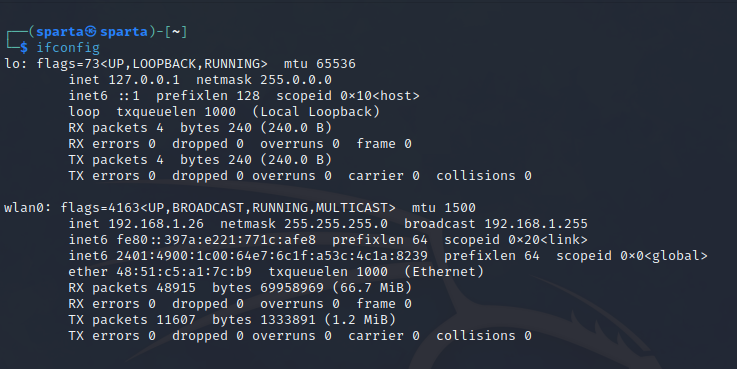

### For Windows

```
ipconfig
```


### For Linux

```
ifconfig
```



## IP Address

    IP addresses are unique numerical identifiers assigned to devices connected to a network. They are used for routing data packets across the internet or a local network, and allow devices to communicate with each other over a network. An IP address can be either static or dynamic, meaning it can be permanently assigned to a device or assigned dynamically by a network's DHCP server.

### IPv4

    IPv4 is the older and more widely used protocol, and it uses 32-bit addresses, allowing for a maximum of approximately 4.3 billion unique addresses. As the number of devices connected to the internet has grown rapidly over the years, the availability of unique IPv4 addresses has become limited, leading to the development and adoption of IPv6.

### IPv6

IPv6 uses 128-bit addresses, allowing for an enormous number of unique addresses, which is enough to accommodate the growth of devices on the internet for the foreseeable future. IPv6 also includes new features, such as built-in security and improved support for mobile devices and the Internet of Things (IoT).
