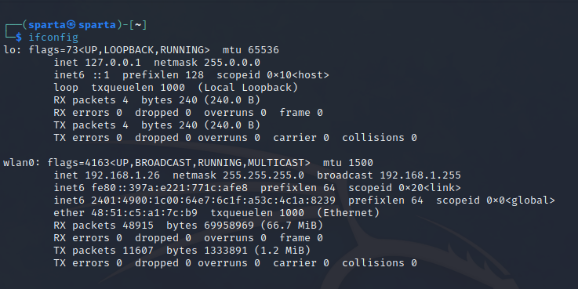

### For Linux

```
ifconfig
```



Here MAC address is the ether - 48:51:c5:a1:7C:b9
Where 48:51:c5 is the Identifer address which in here represents the Intel Corporation

## MAC Address

MAC addresses are unique identifiers assigned to network interface controllers (NICs) of network devices such as computers, routers, and switches. They are used to uniquely identify a device on a network, and they are permanent and cannot be changed. MAC addresses are used in the process of delivering data packets between devices on the same network, and help to prevent collisions in data transmission.
